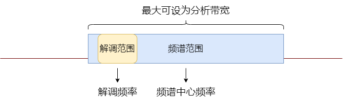

# 网格化监测系统API说明 v1.0

## 概述

该文档介绍系统的编程接口，指导开发者进行二次开发，构建自己的无线电监测应用程序。系统的接口基于`protobuf`和`gRPC`技术，采用语言中立的`proto`文件描述接口及消息。开发者可以根据个人喜好选择开发语言和开发环境。

## 典型C++/Qt环境搭建

### 依赖项

- Win7、Win10操作系统
- VS2015 update3 
- Qt5.7或以上
- vcpkg（需添加了gRPC）

### C++ API生成

- 修改`compile.bat`中的前两行，将`PROTO_INCLUDE_DIR`和`GPRC_CPP_PLUGIN`与本机`vcpkg`的相关目录一致，例如，假设`vcpkg`安装于C盘根目录，则调整`PROTO_INCLUDE_DIR`和`GPRC_CPP_PLUGIN`路径如下：

```bash
set PROTO_INCLUDE_DIR=C:\vcpkg\installed\x64-windows\include\
set GPRC_CPP_PLUGIN="C:\vcpkg\installed\x64-windows\tools\grpc\grpc_cpp_plugin.exe"
```

- 双击运行`compile.bat`，`generated_cpp`文件夹下将会产生若干.h和.cc文件，把这些文件拷贝到自己的工程目录下

- 在自己的工程中添加宏定义`_WIN32_WINNT=0x0600`，如果开发环境为`vs2019`还需要在链接依赖项中添加`Ws2_32.lib;Crypt32.lib`

  其他方面请参考https://grpc.io/docs/tutorials/basic/cpp

建议开发者先了解熟悉`protobuf`和`gRPC`的相关技术，再进行二次开发。

## 接口说明

系统提供的接口，分布于`sensor.proto、scan.proto、pscan.proto、IF_scan.proto、discrete_scan.proto、analog_demod.proto、tdoa.proto、iq_accquire、drone_detect`这几个文件中。其中`sensor.proto`文件描述了通用的消息类型和传感网络管理接口，`scan.proto pscan.proto IF_scan.proto discrete_scan.proto`分别描述了全景扫描，中频扫描，离散扫描的消息类型和接口，`analog_demod.proto`描述了模拟解调的消息类型和接口，`tdoa.proto`描述了`TDOA`定位的消息类型和接口，`iq_accuqire`描述了IQ采集的消息和接口，`drone_detect`描述了无人机探测的消息类型和接口。

### sensor.proto
该文件对应射频传感器网络的管理功能，用于传感器节点发现、节点信息获取、节点控制等。
该文件包含三个接口：

```protobuf
service RFNodeService {
  rpc ListAllNodes(google.protobuf.Empty) returns (NodesInfo) {}
  rpc GetNodeInfo(NodeId) returns (NodeInfo) {}
  rpc NodeControl(NodeControlRequest) returns (NodeReply) {}
}
```

1. `rpc ListAllNodes(google.protobuf.Empty) returns (NodesInfo) {}`

   `ListAllNodes()`接口用于获取目前所有在线的传感器节点信息，`GetNodeInfo()`接口获得指定传感器的节点信息，`NodeControl`接口用于节点控制，比如操纵节点重启，停止所有运行中的任务等。接口返回一个`NodesInfo`消息，该消息包含了所有在线节点的信息，每一个节点的信息用一个`NodeInfo`表示。（注意`NodesInfo`和`NodeInfo`是两个不同的消息）。客户端可以采用轮询的方式，周期性调用该API，获取系统当前的节点信息，如果有节点新增或者掉线，应及时更新客户端的节点信息数据。`NodeInfo`是一个`protobuf`消息，定义如下：

```protobuf
//感知节点信息
message NodeInfo {
  NodeId id = 1;          //节点id
  string name = 2;        //节点名字
  Timestamp last_heard_time = 3;  //最近一次通信的时刻
  Position position = 4;          //节点位置
  repeated DeviceId devices = 5;  //隶属于节点的设备列表
  repeated TaskSummary tasks = 6; //节点正在运行的任务列表
}
```

2. `rpc GetNodeInfo(NodeId) returns (NodeInfo) {}`

   `GetNodeInfo()`接口用于获取指定节点的信息，由`NodeId`指明。

3. `rpc NodeControl(NodeControlRequest) returns (NodeReply) {}`

   `NodeControl()`接口用于节点控制，包括停止节点所有任务、节点重启、节点自检等，控制请求`NodeControlRequest`消息定义为：

```protobuf
//节点控制请求
message NodeControlRequest{
  repeated NodeId node_id = 1;  //节点id
  NodeControlType type = 2;     //控制类型
}
```

### scan.proto

该文件定义了系统**频谱扫描类型**功能的通用消息，全景扫描、离散扫描、中频扫描都会用到这些消息。

1. `FrequencySpan`消息定义了一个频率范围，该范围包含了起始频率和终止频率，单位均为`Hz`。

```protobuf
//频率范围
message FrequencySpan {
  double start_freq = 1;    //起始频率
  double stop_freq  = 2;    //终止频率
}
```

2. `SignalDescriptor`消息定义了一个频域上的信号，可用来表示信号检测和门限判决的结果。

```protobuf
//信号描述符
message SignalDescriptor {
  double center_freq = 1;   //中心频率
  double bandwidth = 2;     //带宽 
  float peak = 3;           //峰值
  float channel_power = 4;  //信号功率
  int32 emerge_count = 5;   //出现次数
}
```

3. `ResultOption`消息定义了系统在频谱扫描任务中的数据处理选项，这些选项包括数据保持、信号检测、门限判决。用户可以根据需要设置这些选项，如果选项被设置为`true`，则功能选项被激活，回送给客户端的结果中也随之会带有相应的处理数据，反之则不进行处理，结果中该部分也为空。

```protobuf
//结果选项
message ResultOption{
  bool enable_data_hold = 1;  //使能数据保持
  bool enable_auto_detect = 2;  //使能信号检测
  bool enable_threshold = 3;    //使能门限判别
}
```

4. `DetectResult`消息定义了信号检测的结果，结果中包含两项，一为系统自动生成的检测线，二为检出的信号列表。

```protobuf
//信号检测结果
message DetectResult{
  repeated float ref_trace = 1; //检测线
  repeated SignalDescriptor detect_signals = 2; //检出的信号列表
}
```

5. `ThresholdResult`消息定义了门限判别的结果，结果中为通过门限比对产生的超过门限的频段列表。

```protobuf
//门限判别结果
message ThresholdResult{
  repeated FrequencySpan over_threshold_signals = 1; //超出门限的信号列表
}
```

6. `DataHoldResult`消息定义了数据保持的结果，结果中包含两项，一为最大保持曲线，二为最小保持曲线。

```protobuf
//数据保持结果
message DataHoldResult{
  repeated float minhold_trace = 1; //最大保持线
  repeated float maxhold_trace = 2; //最小保持线
}
```

7. `ResultBody`消息定义了频谱的总结果，包含当前频率范围、频谱曲线，另外根据用户设定的选项，可能包含上面[4, 6]的子消息。

   注意：`Resultbody`中的`freq_span`和`realtime_trace`是每次结果肯定会有的，而`data_hold_result`、`detect_result`、`threshold_result`则可能为空，取决于用户在启动任务时的`ResultOption`选项。用户可以利用`protobuf`提供的消息接口`has_xxx`来判断子消息的有无，例如使用`resultBody.has_data_hold_result()`来判断是否存在数据保持的结果。

```protobuf
message ResultBody {
  FrequencySpan freq_span = 1;        //频率范围
  repeated float realtime_trace = 2;  //实时频谱线
  DataHoldResult data_hold_result = 3;  //数据保持结果
  DetectResult detect_result = 4;       //信号检测结果
  ThresholdResult threshold_result = 5; //门限判别结果
}
```

### pscan.proto

`pscan.proto`定义了系统**全景扫描**功能的消息和接口，全景扫描在一个频率范围内快速连续扫描，通常用于在一个较宽的频率范围内进行全范围监测，检测所关注频率范围内存在信号和异常干扰。

包含6个服务接口：

```protobuf
service PScanService {
  rpc Start(StartPScanRequest) returns (TaskAccount) {} //启动任务
  rpc GetResult(TaskId) returns (stream PScanResult) {} //获取任务结果
  rpc ChangeRange(ChangeRangeRequest) returns (NodeReply) {}  //改变监测范围,注意:只改变回传的数据范围,不改变实际的扫描范围
  rpc Stop(TaskId) returns (NodeReply) {}   //停止任务
  rpc RecordOn(TaskAccount) returns (NodeReply) {}  //启动记录,启动后节点会将任务数据保存
  rpc RecordOff(TaskAccount) returns (NodeReply) {}   //停止记录
}
```

1. `rpc Start(StartPScanRequest) returns (TaskAccount) {} `

   `Start()`用于发起一个全景扫描任务，接口需要一个`StartPScanRequest`类型的消息作为请求，服务端会返回一个`TaskAccount`的消息作为响应。全景扫描任务发起的流程大致为：当客户端选择好参与全景扫描的节点和设备以及任务参数后，调用`Start()`，向服务端发起任务请求，服务端会解析`StartPScanRequest`消息，从中得到参与到该任务的传感器节点，就向所有这些节点发送任务参数，得到节点的正常响应后，服务端会将该节点id加到正常响应的节点列表中，并创建一个代表该任务的`TaskAccount`任务账号返回给客户端。
   
   `StartPScanRequest`消息定义：

```protobuf
//启动全景扫描请求
message StartPScanRequest {
  repeated NodeDevice task_runner = 1;  //参与任务的节点设备
  PScanParams pscan_params = 2;         //任务参数
}
```
请求消息的1号字段`task_runner`对应用户选择的节点设备列表，2号字段`pscan_params`是一个`PScanParams`消息，其定义为：

```protobuf
//全景扫描任务参数
message PScanParams {
  FrequencySpan freq_span = 1;          //频率范围,单位Hz
  double        rbw = 2;                //分辨率,单位Hz
  int32         monitor_interval = 3;   //数据回传间隔,单位ms
  int32         expected_points = 4;    //希望显示的点数[101,16001]
  int32         average_count = 5;      //平均次数[0,128]
  int32         attenuation_gain = 6;   //衰减增益[-30, 20]
  int32         antenna = 7;            //天线选择[0,1]
  repeated ThresholdSector threshold_sectors = 8;//门限设置
  ResultOption  result_option = 9;      //结果选项,启用的功能可选
}
```

共包含9个分项

- `freq_scan`是用户设置的全景扫描频率范围，起始频率需小于终止频率，最大可设范围为`[20MHz,6GHz]`，实际的扫描范围可能存在微调，会在结果中给出实际的扫描范围。
- `rbw`分辨率带宽，最小可设为`1Hz`，一般应根据扫描范围设置合适的分辨率，分辨率过小会影响扫描速度，而过高会降低对信号的分辨能力。
- `monitor_interval`回传间隔时间，参与任务的每个节点设备将以`monitor_interval`间隔回传结果，单位毫秒，比较合适的值可选0，100，500，1000。在无线传输时，应适当增加回传间隔。
- `expected_points`用户希望的显示点数，可以任意设置，最佳设置范围为`[101, 16001]`，且数量为奇数，如果设置为零，则系统会传输所有的原始点，不做检波处理。同样，因为检波处理的缘故，实际结果中的显示点数可能并不与`expected_points`一致，应以实际返回的点数为准。
- `average_count`平均次数，当平均次数不为零时，节点接收机会对多帧频谱做叠加统计，形成一帧频谱，默认统计方式是`RMS`平均。
- `attenuation_gain`为射频通道的衰减增益控制，当处理小信号时，应为正值，以增加系统灵敏度，反之，应为负值，以免信号过载。
- `antenna`为天线选择控制，当为0时接收机会选择`天线1`端口，当为1时选择`天线2`端口。
- `threshold_sectors`可以设置若干个需要进行门限判别的子频段。对一些需要搜索干扰信号的频段，可以通过该分项设置，并在`result_option`中使能门限判别，结果中将会带有门限判别的结果。
- `result_option`扫描选项，见`scan.proto`中的说明。

返回值 `TaskAccount`消息定义于`sensor.proto`，每种类型的任务在创建时，系统都会给客户端返回一个`TaskAccount`，该消息包含任务ID号和真正执行该任务的节点设备列表。任务ID是任务的唯一标识，在任务启动后续的API调用时，都要带有任务ID。注意：由于网络超时或节点被占用等各种原因，在任务参数下发时，并非所有节点都会正常响应，客户端程序需要查看`TaskAccount`中的`node_devices`是否与下发任务时选中的节点设备数量一致，如果不一致，意味着有节点没有正常响应，此刻需要写入日志或向用户及时反馈，后续所有其他任务的创建与之类似，都需要对响应结果进行确认，后面不再赘述。

```protobuf
//任务账号
message TaskAccount{
  TaskId task_id = 1;   //任务id
  repeated NodeDevice node_devices = 2; //有效执行该任务的节点
}
```

2. `rpc GetResult(TaskId) returns (stream PScanResult) {} `

   `GetResult()`用于获取该任务的数据。该接口的返回值是一个`PScanResult`消息流，接口会持续的推送`PScanResult`消息到客户端。客户端不应在主线程调用该接口，因为在任务结束之前，该接口的调用不会返回，主线程将得不到控制权。所有流式接口都应有**独立的工作线程**来进行结果的接收。

   `PScanResult`定义如下：

```protobuf
//全景扫描结果
message PScanResult {
  NodeDevice result_from = 1;     //结果来自哪个节点设备
  uint32 sequence_number = 2; //结果顺序号
  Timestamp timestamp = 3;    //时间戳
  ResultBody result_body = 4;     //结果体
}
```

序号1的字段`result_from`表明该消息来自哪个节点设备，序号2和3的字段为时间戳，顺序号，序号4的消息是在`scan.proto`中定义的`ResultBody`，包括频率范围、频谱迹线、信号列表、门限等数据细目。

3. `rpc ChangeRange(ChangeRangeRequest) returns (NodeReply) {} `

   `ChangeRange()`用于更改任务的频率范围。`ChangeRangeRequest`消息定义如下：

```protobuf
//监测范围改变的请求
message ChangeRangeRequest {
  TaskAccount task_account = 1;     //任务账号
  FrequencySpan span = 2;           //要监测的范围
}
```

从中可以看出，该请求向服务端发送了`TaskAccount`和一个待变更的频率范围，服务端在收到该消息后，将会根据`TaskAccount`所列的设备id，向相关的设备节点发送该频率变更指令，待所有节点响应后，会生成一个`NodeReply`消息，返回给客户端。`NodeReply`是一个`CmdHeader`消息的集合，反映了所有执行该请求的设备节点的响应结果，与启动任务时类似，因为无法保证所有响应结果均为正常，所以客户端需要对这个响应结果进行解析，根据错误码来确定后续行为。可能遇到的响应错误情况包括`taskId`非法、频率范围参数非法、节点响应超时等。

`NodeReply`消息定义为

```protobuf
//节点响应
message NodeReply{
  repeated CmdHeader cmd_header = 1;  //命令响应集合
}
```

可以看到，响应结果是一组`CmdHeader`消息，`CmdHeader`消息定义为

```protobuf
message CmdHeader{
  uint32 sequence_number = 1;	//指令顺序号
  ErrorType error_code = 2;		//错误码
  TaskId task_id = 3;			//任务id
  NodeDevice task_runner = 4;	//设备节点id
};
```

值得进一步说明的是`ChangeRange`接口的惯常调用方式。`ChangeRange`是一种对**任务过程进行干预**的API。后面的`RecordOn`和`RecordOff`接口也属于此类API，这类API在其他任务类型中也或多或少存在，这类API通常在任务的执行过程中被用户调用，用来改变任务的行为，用户可以任意设定**所有参与任务的节点集合的一个子集**去处理该请求。

设置的关键在于请求消息中的`taskAccount`，用户可以根据需要，选取节点设备来填充`taskAccount`中`node_devices`子消息，下发给系统，从而让这个子集去执行该请求。例如，客户端如果想让所有任务节点都响应`ChangeRange`，就可以传入任务创建时的`taskAccount`，这种情况下所有参与任务的节点都会执行该请求；如果只想让某个节点设备执行该请求，就只把该设备节点填入`node_devices`中。这样，任务就会变得很灵活，即可以观察同一个频率范围，也可以观察若干不同的频率范围，以适应不同的应用场景。

4. `rpc Stop(TaskId) returns (NodeReply) {}`

   `Stop()`用于停止某个全景扫描任务。接口以`TaskId`作为请求，服务端在收到请求后，会向参与该任务的所有节点发送停止命令，待节点响应后，向客户端返回`NodeReply`响应结果。可能遇到的响应错误情况包括`taskId`非法，节点响应超时等。

5. `rpc RecordOn(TaskAccount) returns (NodeReply) {}`

   `RecordOn()`启动节点端的数据记录功能。该接口向服务端发送了`TaskAccount`，来说明需要开启记录的节点，服务端在收到消息后，会向相关节点发送指令，由节点端执行实际的数据记录（数据将记录在节点本地），待节点响应后，向客户端返回`NodeReply`响应结果。如果有节点已经开始记录或出现其他无法启动记录的情况，将体现在`NodeReply`的错误码中。

6. `rpc RecordOff(TaskAccount) returns (NodeReply) {}`

   `RecordOff()`停止记录功能。该接口向服务端发送了`TaskAccount`，来说明需要停止记录的节点，服务端在收到消息后，会向相关节点发送指令，待节点响应后，向客户端返回`NodeReply`响应结果。如果有的节点之前并没有开启记录，节点则会忽略此操作，并回送错误码。

**全景扫描任务参数范围说明**

全景扫描任务参数`PScanParams`消息中各字段范围如下表：

| 消息                      | 字段             | 范围                                      |
| :------------------------ | :--------------- | :---------------------------------------- |
| PScanParams.FrequencySpan | start_freq       | [20MHz，6GHz]                             |
| PScanParams.FrequencySpan | stop_freq        | [20MHz，6GHz]                             |
| PScanParams               | rbw              | [1Hz，1MHz]                               |
| PScanParams               | monitor_interval | 比较合适的值可选0ms，100ms，500ms，1000ms |
| PScanParams               | expected_points  | [101，16001]                              |
| PScanParams               | average_count    | [0，128]                                  |
| PScanParams               | attenuation_gain | [-30，20]                                 |
| PScanParams               | antenna          | 可选0或1                                  |

### IF_scan.proto

`IF_scan.proto`定义了系统中频扫描功能的消息和接口，中频扫描是一种在接收机**分析带宽**范围内（例如`40MHz`）对某个频点或频段进行深入分析的扫描任务类型，以得到信号的特征参数，调制类型，ITU参数等。

包含3个服务接口

```protobuf
//中频扫描API
service IFScanService {
    rpc Start(StartIFScanRequest) returns (TaskAccount) {}  //启动任务
    rpc GetResult(TaskId) returns (stream IFScanResult) {}  //获取任务结果
    rpc Stop(TaskId) returns (NodeReply) {}                 //停止任务
}
```

1. `rpc Start(StartIFScanRequest) returns (TaskAccount) {}`

   `Start()`启动一个中频分析任务，以`StartIFScanRequest`类型的消息作为请求，系统返回`TaskAccount`消息作为本任务账号。`StartIFScanRequest`的第一个消息为执行任务的节点设备，第二个消息为`IFScanParams`类型的任务参数。

```protobuf
//启动中频扫描请求
message StartIFScanRequest{
    repeated NodeDevice task_runner = 1;    //执行任务的单元
    IFScanParams ifscan_params = 2;         //中频扫描参数
}
```

```protobuf
//中频扫描参数
message IFScanParams {
    double center_freq = 1;         //中心频率 单位 Hz
    double bandwidth = 2;           //带宽 单位 Hz
    double rbw = 3;                 //分辨率带宽 单位 Hz
    int32 interval = 4;             //回传间隔 单位ms
    int32 spectrum_points = 5;      //频谱显示点数
    bool  iq_output = 6;            //是否回传IQ
    int32 attenuation_gain = 7;     //衰减增益
    int32 antenna = 8;              //天线选择
    Option options = 9;             //中频扫描选项
}
```

`IFScanParams`消息描述的中频扫描的任务参数。

- `center_freq` 待分析的频段中心频率
- `bandwidth`待分析的频段带宽，最大可设为`40e6`，即`40MHz`
- `rbw`频谱的分辨率，同全景扫描
- `interval`回传间隔，典型可设置为`1000`，即1秒回传一次结果
- `spectrum_points`希望的频谱显示点数，同全景扫描
- `iq_output`是否传送`IQ`原始数据
- `attenuation_gain`衰减增益设置，同全景扫描
- `antenna` 天线选择，同全景扫描
- `options`中频扫描选项

中频扫描的选项包含两项，分别为使能脉冲测量和使能时间同步测量。通过`Option`消息类型定义。

```protobuf
//中频扫描选项
message Option{
    bool enable_pulse_measurement = 1;  //使能脉冲测量
    Timestamp sync_acquire_time = 2;    //使能多点时间同步测量
}
```

- `enable_pulse_measurement`为`true`时，使能脉冲测量功能，结果中将带有脉冲测量的结果
- `sync_acquire_time`有效时，使能时间同步测量功能，多个节点的中频分析结果将是在时间同步的前提下采集并分析处理的。

2. `rpc GetResult(TaskId) returns (stream IFScanResult) {}`

   `GetResult()`用于获取中频扫描结果。该接口的返回值是一个`IFScanResult`消息流，注意应有**独立的工作线程**来进行结果的接收。

```protobuf
//中频扫描结果
message IFScanResult {
    NodeDevice result_from = 1;       //结果来源
    uint32 sequence_number = 2;       //顺序号
    Timestamp timestamp = 3;            //时间戳
    repeated float spectrum_trace = 4;  //频谱曲线
    repeated float IQ_trace = 5;        //IQ曲线
    ITUParams ituParams = 6;            //ITU参数
    PulseParams pulseParams = 7;        //脉冲测量参数
}
```

结果中，`result_from`，`sequence_number`，`timestamp`与全景扫描类似，不再赘述。第四项`spectrum_trace`给出中频分析的频谱曲线；第五项`IQ_trace`在中频分析选项中使能`enable_pulse_measurement`时，将给出原始IQ曲线，不使能情况下数组长度为0；第六项`ituParams`定义如下，该子消息给出信号的ITU参数。

```protobuf
//ITU参数
message ITUParams{
    SignalModulateType modulate_type = 1; //调制类型
    double center_freq = 2;         //中心频率
    double bandwidth = 3;           //带宽
    double power = 4;               //功率
}
```

第七项`pulseParams`定义如下，该子消息在中频分析选项中使能脉冲测量时，将给出脉冲测量的参数，不使能则不存在。

```protobuf
//脉冲测量参数
message PulseParams{
    double pulse_level = 1;         //脉冲幅度
    double pulse_width = 2;         //脉冲宽度
    double pulse_period = 3;        //脉冲周期
    double occupancy = 4;           //占空比
}
```

3. `rpc Stop(TaskId) returns (NodeReply) {} `

   以任务id为请求，结束中频扫描任务。

**中频扫描任务参数范围说明**

中频扫描任务参数`IFScanParams`消息中各字段范围如下表：

| 消息         | 字段             | 范围                 |
| :----------- | :--------------- | :------------------- |
| IFScanParams | center_freq      | [20MHz，6GHz]        |
| IFScanParams | bandwidth        | [0Hz，40MHz]         |
| IFScanParams | rbw              | [1Hz，1MHz]          |
| IFScanParams | interval         | 典型值可设置为1000ms |
| IFScanParams | spectrum_points  | [101，16001]         |
| IFScanParams | attenuation_gain | [-30，20]            |
| IFScanParams | antenna          | 可选0或1             |

### discrete_scan.proto

`discrete_scan.proto`定义了系统扫描功能的消息和接口，离散扫描是一种可以同时扫描多个离散频段的任务类型，可满足若干业务频段同时监测的需求。

包含3个服务接口

```protobuf
//离散扫描API
service DScanService {
    rpc Start(StartDScanRequest) returns (TaskAccount) {}   //启动离散扫描
    rpc GetResult(TaskId) returns (stream DScanResult) {}   //获取离散扫描结果
    rpc Stop(TaskId) returns (NodeReply) {}                 //停止离散扫描
}
```

1. `rpc Start(StartDScanRequest) returns (TaskAccount) {}`

   `Start()`接口用于启动一个离散扫描任务，以`StartDScanRequest`类型的消息作为请求，系统返回`TaskAccount`消息作为本任务账号。`StartDScanRequest`的第一个消息为执行任务的节点设备，第二个消息为`DScanParams`类型的任务参数。

```protobuf
//启动离散扫描请求
message StartDScanRequest{
    repeated NodeDevice task_runner = 1;    //执行任务的节点设备
    DScanParams dscan_params = 2;           //任务参数
}
```

```protobuf
//离散扫描任务参数
message DScanParams{
    repeated DScanSegment segments = 1; //要扫描的频段列表
    int32         monitor_interval = 2; //回传间隔,单位ms
    ResultOption  result_option = 3;    //结果选项
}
```

`DScanParams`中的第一项为频段列表，其中每个元素为`DScanSegment`类型的消息；第二项为回传间隔，第三项为结果选项，可参见`scan.proto`中的定义。

```protobuf
//离散扫描的单段参数
message DScanSegment{
    FrequencySpan freq_span = 1;        //频率范围
    double        rbw = 2;              //分辨率带宽 单位 Hz
    int32         expected_points = 3;  //希望显示的点数
    float         threshold = 4;        //门限电平,在使能门限判别时有效
    int32         average_count = 5;    //平均次数
    int32         attenuation_gain = 6; //增益衰减
    int32         antenna = 7;          //天线选择
}
```

`DScanSegment`消息描述了离散扫描其中单个频段参数。

- `freq_span`频率范围，在离散扫描中，频率范围完全独立，可以和其他频段的频率范围区间相互重叠，也可乱序。
- `rbw`分辨率带宽，同全景扫描。
- `expected_points`显示点数，同全景扫描。
- `threshold`本频段的门限电平，当使能了门限判别功能时有效。
- `average_count`平均次数，同全景扫描。
- `attenuation_gain`增益衰减，同全景扫描。
- `antenna`天线选择，同全景扫描。

应注意`DScanSegment`的所有参数只作用于一个频段，离散扫描的段与段之间是高度独立的，对于系统硬件而言，扫描每个频段都会根据`DScanSegment`的参数进行重置再启动扫描。客户端在显示时，建议采用多窗口，以对应多频段。

2. `rpc GetResult(TaskId) returns (stream DScanResult) {}`

   `GetResult()`接口用于获取离散扫描结果。该接口的返回值是一个`DScanResult`消息流，注意应有**独立的工作线程**来进行结果的接收。

```protobuf
//离散扫描任务结果
message DScanResult {
    NodeDevice result_from = 1;             //结果来源
    uint32 sequence_number = 2;             //顺序号
    Timestamp timestamp = 3;                //时间戳
    repeated ResultBody segment_result = 4; //所有频段的扫描结果
}
```

其结果定义与全景扫描很类似，区别在于序号为4的字段，在这里是一个**repeated**的消息。这与离散扫描的特点是一致的，因为离散扫描任务会对分布于多个离散区间的频段进行扫描，自然就会产生多个扫描结果。

3. `rpc Stop(TaskId) returns (NodeReply) {} `

   以任务id为请求，结束离散扫描任务。

**离散扫描任务参数范围说明**

离散扫描任务参数`DScanParams`消息中各字段范围如下表：

| 消息                                   | 字段             | 范围                                      |
| :------------------------------------- | :--------------- | :---------------------------------------- |
| DScanParams.DScanSegment.FrequencySpan | start_freq       | [20MHz，6GHz]                             |
| DScanParams.DScanSegment.FrequencySpan | stop_freq        | [20MHz，6GHz]                             |
| DScanParams.DScanSegment               | rbw              | [1Hz，1MHz]                               |
| DScanParams.DScanSegment               | expected_points  | [101, 16001]                              |
| DScanParams.DScanSegment               | average_count    | [0, 128]                                  |
| DScanParams.DScanSegment               | attenuation_gain | [-30，20]                                 |
| DScanParams.DScanSegment               | antenna          | 可选0或1                                  |
| DScanParams                            | monitor_interval | 比较合适的值可选0ms，100ms，500ms，1000ms |

### analog_demod.proto

`analog_demod.proto`定义了模拟解调任务的消息和接口。模拟解调是一种解调AM、FM等模拟调制信号，实时输出该信号频谱和音频`PCM`码流的任务类型，系统支持分析带宽内的任意频点解调，可以通过在任务执行过程中随时切换频点，来监听不同频点的声音。

包含四个接口

```protobuf
//模拟解调API
service AnalogDemodService {
  rpc Start(StartAnalogDemodRequest) returns (TaskAccount) {} //启动任务
  rpc GetResult(TaskId) returns (stream DemodResult) {}       //获取任务结果
  rpc ChangeChannel(ChangeChannelRequest) returns (NodeReply) {}  //改变解调信道
  rpc Stop(TaskId) returns (NodeReply) {}   //停止任务
}
```

1. `rpc Start(StartAnalogDemodRequest) returns (TaskAccount) {} `

   `Start()`接口用于启动一个模拟解调任务，以`StartAnalogDemodRequest`类型的消息作为请求，系统返回`TaskAccount`消息作为本任务账号。`StartAnalogDemodRequest`的第一个消息为执行任务的节点设备，第二个消息为`AnalogDemodParms`类型的任务参数。

```protobuf
//启动模拟解调请求
message StartAnalogDemodRequest {
  repeated NodeDevice task_runner = 1;  //参与任务的设备节点
  AnalogDemodParms params = 2;          //任务参数
}
```

```protobuf
//模拟解调参数
message AnalogDemodParms{
  AnalogDemodChannel demod_channel = 1; //解调信道
  Demodulation  demod_type = 2;         //解调类型
  int32         attenuation_gain = 3;   //增益衰减[-30,20]
  int32         antenna = 4;            //天线选择[0,1]
  AnalogSpectrumParms spectrum_param = 5;//频谱参数,可选,如果不设置则不回传频谱结果
}
```

`AnalogDemodParms`消息定义了模拟解调任务参数。

- `demod_channel`为一个`AnalogDemodChannel`的消息，用于设置解调频率和解调带宽
- `demod_type`为要解调的调制类型
- `attenuation_gain`为增益衰减设置，同全景扫描
- `antenna`为天线选择，同全景扫描
- `AnalogSpectrumParms`为频谱参数，可选，如果该子消息为空，则结果中只包含音频，没有频谱曲线

```protobuf
//解调的频谱参数
message AnalogSpectrumParms{
  double        center_frequency = 1; //频谱的中心频率 单位 Hz
  double        bandwidth = 2;        //频谱的带宽, 单位 Hz ≤40MHz
  int32         expected_points = 3;  //希望显示的点数
  int32         average_count = 4;    //平均次数[0,128]
  int32         monitor_interval = 5;  //回传间隔 单位ms
}
```

- `center_frequency`用于设置频谱的中心频率

- `bandwidth`用于设置频谱的带宽

  频谱的中心频率与带宽确定了一个范围，而`demod_channel`包括解调频率和解调带宽，也是一个范围。两者之间的关系如下图所示，解调范围一定要落在频谱范围之内，解调范围像一个滑动窗口，可以在频谱范围内任意滑动，解调范围超出频谱范围的话为无效的参数。客户端启动任务时，若没有设置`AnalogSpectrumParms`，系统会自动配置一个频谱范围，这个范围以解调频率为中心，以`40MHz`为带宽。



- `expected_points`希望显示的频谱点数，同全景扫描
- `average_count`平均次数，同全景扫描
- `monitor_interval`回传间隔，同全景扫描

2. `rpc GetResult(TaskId) returns (stream DemodResult) {}`

   `GetResult()`用于获取解调的结果，该接口的返回值是一个`DemodResult`消息流，注意应有**独立的工作线程**来进行结果的接收。

```protobuf
//解调结果
message DemodResult {
  NodeDevice result_from = 1;     //来自哪个节点设备
  AudioResult audio_result = 2;   //音频结果,可能为空
  scan.ResultBody spectrum_result = 3;//频谱结果,可能为空
}
```

结果中标号为1的字段说明数据来源；2号字段包含解调音频数据；3号字段包含频谱数据，可能为空，只有当任务参数中带有`AnalogSpectrumParms`消息时，结果中才会带有3号字段。

标号2的字段是一个`AudioResult`类型的消息，其中的`current_channel`表明目前解调的信道参数，`audio_sampleRate`表明音频采样速率，`pcm_block`为音频的`pcm`码流。解调音频固定采用单声道16位的格式。

```protobuf
//音频结果
message AudioResult{
  AnalogDemodChannel current_channel = 1; //当前解调的信道
  int32 audio_sampleRate = 2;         //音频流速率
  repeated int32 pcm_block = 3;      //音频PCM码流
}
```

标号3的字段是一个在`scan.proto`中定义的频谱结果类型，默认不启用数据保持和门限判别功能， 仅输出实时频谱曲线和信号列表。

3. `rpc ChangeChannel(ChangeChannelRequest) returns (NodeReply) {}`

   `ChangeChannel()`用于改变解调信道，可以在任务执行过程中调用，来改变要监听的信道。注意信道的范围不能超过频谱范围，否则设置无效。

```protobuf
//改变解调信道的请求
message ChangeChannelRequest {
  TaskAccount task_account = 1;     //任务账号
  AnalogDemodChannel channel = 2;   //要解调的信道
}
```

4. `rpc Stop(TaskId) returns (NodeReply) {} `

   以任务id为请求，结束解调任务。

**模拟解调参数范围说明**

模拟解调任务参数`AnalogDemodParms`消息中各字段范围如下表：

| 消息                                 | 字段             | 范围                                      |
| :----------------------------------- | :--------------- | :---------------------------------------- |
| AnalogDemodParms.AnalogDemodChannel  | demod_frequency  | [20MHz，6GHz]                             |
| AnalogDemodParms.AnalogDemodChannel  | demod_bandwidth  | [1kHz，1MHz]                              |
| AnalogDemodParms                     | attenuation_gain | [-30，20]                                 |
| AnalogDemodParms                     | antenna          | 可选0或1                                  |
| AnalogDemodParms.AnalogSpectrumParms | center_frequency | [20MHz，6GHz]                             |
| AnalogDemodParms.AnalogSpectrumParms | bandwidth        | [0，40MHz]                                |
| AnalogDemodParms.AnalogSpectrumParms | expected_points  | [101，16001]                              |
| AnalogDemodParms.AnalogSpectrumParms | average_count    | [0，128]                                  |
| AnalogDemodParms.AnalogSpectrumParms | monitor_interval | 比较合适的值可选0ms，100ms，500ms，1000ms |

### TDOA.proto

该文件定义了系统TDOA定位功能的消息和接口，包含四个接口

```protobuf
//tdoa API
service TDOAService {
  rpc Start(StartTDOARequest) returns (TaskAccount) {}  //启动任务
  rpc GetProduction(TaskId) returns (stream TDOAProduction) {}  //获取任务数据
  rpc GetTaskProgress(TaskId) returns (TDOAProgress) {}         //获取任务各节点的数据传输进度
  rpc Stop(TaskId) returns (NodeReply) {}               //停止任务
}
```

1. `Start()`用于发起一个TDOA任务，客户端通过该接口向服务端发送`StartTDOARequest`消息，服务端回送`TaskAccount`消息作为响应。`StartTDOARequest`消息定义为

```protobuf
message StartTDOARequest{
  repeated NodeDevice task_runner = 1;	//参与TDOA定位任务的节点集合
  TDOAParams task_parms = 2;	//任务参数
}
```

其中的第一项为参与本次TDOA任务的设备节点，TDOA任务至少需要两个节点，当为2个节点时为测向，当≥3个节点时，执行多站定位。第二项`TDOAParams`消息为TDOA任务参数，定义为：

```protobuf
//tdoa任务参数
message TDOAParams {
  repeated TargetSignal target_signals  = 1;  //要定位的目标
  Timestamp sync_acquire_time = 2;          //同步采集起始时刻
  uint32 interval_msec = 3;                 //采集的时间间隔,单位 ms
  TDOAOption option = 4;
}
```

- `target_signals`为待定位目标信号的列表，其中的每一项为描述一个信号的消息`TargetSignal`，定位任务中应至少包含1个`TargetSignal`。`TargetSignal`中各项参数比较明确，需要进一步说明的是第三项`power`，该值用来告诉节点设备端，只有采集的信号电平值大于`power`设定的值，才允许上传数据，否则无需上传。这样可以在大量分布于各处的设备节点共同参与执行TDOA任务时，减少数据的传输量和处理量。

```protobuf
//目标的信号特征(待定位的目标)
message TargetSignal {
  double center_freq = 1; //中心频率,单位 Hz
  double bandwidth = 2;   //信号带宽,单位 Hz
  double power = 3;       //允许节点上传数据的最低电平要求,参与任务的节点设备在采集时,只有高于该值才会将采集的数据上传到中心
  int32 attenuation_gain = 4; //采集该信号时的增益衰减,[-30, 20],对于小信号应是开启增益
  int32 antenna = 5;      //天线选择[0,1]
}
```

- `sync_acquire_time`用于告诉节点设备端同步采集信号数据的起始时刻，采用UTC的时间标准。
- `interval_msec`采集间隔，最短为100ms，在无线传输下，该值以[500,2000]为宜，不宜过短，以免阻塞传输。
- `option`TDOA任务选项，可用于使能一些过程数据输出或双站测向等特殊定位方式。

```protobuf
message TDOAOption{
  bool enable_spectrum = 1;
  bool enable_iq = 2;
  bool enable_coorelation = 3;
}
```

2. `rpc GetProduction(TaskId) returns (stream TDOAProduction) {}  `

   `GetProduction()`用于获取TDOA定位的结果，该接口的返回值是一个`TDOAProduction`消息流，注意应有**独立的工作线程**来进行结果的接收。结果中包含一次定位的过程数据和结果数据。

```protobuf
//TDOA任务产生的数据
message TDOAProduction{
  TDOAIndex index = 1;                      //索引
  TDOAError error_code = 2;                 //错误码
  repeated BlockBrief block_brief = 3;      //数据块摘要
  repeated TDOATrace details = 4;           //过程迹线（频谱、IQ、互相关）
  BatchCorrelation correlation_info = 5;    //互相关结果
  TargetPosition position_info = 6;         //定位结果
}
```

其中

- `index`中包含本次结果属于第几次定位和第几个目标。
- `error_code`指明错误码信息，只有是`TDOA_ERR_NONE`的情况下，定位结果是有效的。
- `block_brief`包含本次定位的所有数据块摘要，主要包括采集设备id、采集位置、采集时刻、是否包含数据等信息。
- `details`是一组定位过程中产生的曲线数据，其中的每一个数据项是一个`TDOATrace`消息，根据任务选项的设定，可能是频谱曲线、IQ曲线、互相关曲线。
- `correlation_info`是定位过程中产生的互相关数据。
- `position_info`包含定位结果，其中的`target_position`给出目标的方位信息。系统会根据实际的互相关计算结果，自行确定定位方法，根据定位方法的不同，该子消息中的`target_position`中解的个数和含义也不同，具体使用请参照示例程序。

```protobuf
//tdoa过程数据(各种迹线)
message TDOATrace {
  enum TraceType {
    TDOA_SPECTRUM = 0;  //频谱
    TDOA_IQ = 1;	      //iq
    TDOA_CORRELATE = 2;	//相关线
  }
  TraceType type = 1;   //迹线类型
  repeated NodeDevice result_from = 2; //数据来源
  repeated float trace_data = 3;     //迹线数据
}
```

3. `rpc GetTaskProgress(TaskId) returns (TDOAProgress) {} `

   `GetTaskProgress()`用来获取当前TDOA任务的状态，可以通过这个接口查看所有任务节点上报数据的进度。

```protobuf
//tdoa 数据传输状态
message SensorAcquireProgress{
  NodeDevice sensor = 1;    //节点设备id
  TDOAIndex last_received = 2;  //收到的最新索引
}

//tdoa任务的进展情况
message TDOAProgress{
  repeated SensorAcquireProgress progress = 1;
}
```

4. `rpc Stop(TaskId) returns (NodeReply) {} `

   以任务id为请求，结束TDOA任务。

**TDOA定位任务参数范围说明**

TDOA定位任务参数`TDOAParams`消息中各字段范围如下表：

| 消息                    | 字段             | 范围          |
| :---------------------- | :--------------- | :------------ |
| TDOAParams.TargetSignal | center_frequency | [20MHz，6GHz] |
| TDOAParams.TargetSignal | bandwidth        | [0，40MHz]    |
| TDOAParams.TargetSignal | attenuation_gain | [-30，20]     |
| TDOAParams.TargetSignal | antenna          | 可选0或1      |

### iq_acquire.proto

该文件定义了系统IQ数据采集任务的消息和接口。

共包含5个接口

```protobuf
//IQ扫描API
service IQService
{
    rpc Start(StartIQRequest) returns (TaskAccount) {}  //启动任务
    rpc GetResult(TaskId) returns (stream IQResult) {}  //获取任务结果
    rpc Stop(TaskId) returns (NodeReply) {}             //停止任务
    rpc RecordOn(TaskAccount) returns (NodeReply) {}    //开启节点端的记录
    rpc RecordOff(TaskAccount) returns (NodeReply) {}   //关闭节点端的记录
}
```

1. `rpc Start(StartIQRequest) returns (TaskAccount) {}`

   `Start()`用于启动一个IQ采集任务，请求消息类型为`StartIQRequest`，服务端回送的响应类型为任务账号。和其他任务类似，请求中包含了要执行任务的若干节点设备，以及任务参数。

```protobuf
//启动IQ扫描的请求
message StartIQRequest{
    repeated NodeDevice task_runner = 1;    //任务执行单元
    IQSweepParams sweep_params = 2;         //扫描参数
}
```

```protobuf
//IQ扫描参数
message IQSweepParams{
	uint32       num_sweeps = 1;                    //扫描次数[0,max_uint32]
	uint32		 num_blocks = 2;	                 //每个频点的扫描块个数[0,max_uint32]	
	uint32		 num_transfer_samples = 3;          //每个扫描块的采集点数[512,1024,2048]
    TimeTriggerParams time_trigger_params = 4;      //时间触发参数,可选项
    repeated IQSegmentParams segment_params = 5;    //要采集的频点
}
```

任务参数`IQSweepParams`由5部分组成。之所以称之为IQ Sweep，是因为IQ采集也可以像频谱扫描那样，自动采集多个频点。

- `num_sweeps`总的IQ扫描次数，应为非负数，0代表无限次扫描
- `num_blocks`每个频点采集的`IQ`数据块数目，应为非负数，0代表在该频点无限次采集，注意在多个频点采集时，`num_blocks`不应设为0，因为一旦为零，任务执行单元会停留在该频点无限期的采集下去。
- `num_transfer_samples`为每个`IQ`数据块的采样点个数，可设为2的幂次方个，最大可设为2048。此参数只是约定了数据在网络上传输的长度，与IQ的无缝采集特性并不相关，IQ数据块与块之间尽管会打包成两个网络报文传输，但不会影响其时域上的连续性，无缝采集特性是靠设备内的大容量高速`RAM`缓冲区来保证的。
- `time_trigger_params`是一个`TimeTriggerParams`类型的消息，包含时间触发的参数，是可选项。在`TimeTriggerParams`中：
  1. `trigger_type`表示触发类型，可选相对时间和绝对时间
  2. `trigger_time`表示触发时间，在使用相对时间触发时，`trigger_time`表达的是延迟量的概念，执行单元会以启动任务的时刻为基准，向后延迟这段时间，再开始采集。在使用绝对时间触发时，`trigger_time`表达的是绝对时刻的概念，执行单元会以`trigger_time`所设定的时刻开始采集。在实际使用中，绝对时间触发要更常用一些，因为这种方式可以让多个节点进行非常精准的时间同步采集。绝对时间触发时，`trigger_time`的秒值是一个UTC的时刻，c++可以通过调用`time(nullptr)`来获得当前系统时间对应的UTC秒值，此时就需要注意宿主计算机的系统时间要与实际时间相符，不然下发到节点设备的触发时刻会与GNSS系统的时间相差太大，导致无触发或早触发。
  3. `sweep_interval`表示两次扫描之间的间隔时间。
  4. `segment_interval`表示一次扫描过程中，相邻两个频点之间的间隔时间。该值有`100ms`的下限，应满足`sweep_interval> (N * segment_interval + 200)`，`N`为要扫描的频点数。

```protobuf
//时间触发参数
message TimeTriggerParams{
    //触发类型
    enum TimeTriggerType{
        NONE = 0;
        ABS_TIME = 0x2; //绝对时间
        REL_TIME = 0x4; //相对时间
    }
    TimeTriggerType trigger_type = 1;   //触发类型
    Timestamp       trigger_time = 2;   //触发时刻
    uint32		    sweep_interval = 3;     //扫描间隔,单位ms
	uint32		    segment_interval = 4;   //频点间隔,单位ms
}
```

- `segment_params`表示要采集的频点集合。集合中的每个项为一个`IQSegmentParams`类型的消息。其中标号为1、3、4的字段很好理解，和其他任务类似。
  1. `sample_rate`表示采集该信号所使用的采样率，采样率多档可选，可设置为56e6、28e6、14e6...，应根据信号的带宽合理选择采样率。
  2. `level_trigger_params`表示在该频点的幅度触发参数，可选项。当为空时，表示不在该频点使用幅度触发。注意幅度触发与时间触发互斥，当使能时间触发时，`IQSegmentParams`不应再带有幅度触发参数。

```protobuf
//IQ扫描的单频点参数
message IQSegmentParams{
    double center_freq = 1;             //中心频率,单位Hz[20MHz,6GHz]
    double sample_rate = 2;             //采样率,单位Hz[56M, 28M, 14M, 7M, 3.5M, 1.75M, 0.875M...]
    int32  attenuation_gain = 3;        //增益衰减[-30,20]
    int32  antenna = 4;                 //天线选择[0,1]
    LevelTriggerParams level_trigger_params = 5;//幅度触发参数,可选项
}
```

```protobuf
//幅度触发参数
message LevelTriggerParams{
    //触发类型
    enum LevelTriggerType{
        NONE = 0;
        LEVEL = 0x8;    //幅度触发
        RISING = 0x10;  //上升沿触发
        FALLING = 0x18; //下降沿触发
    }
    LevelTriggerType    trigger_type = 1;   //触发类型
    float               trigger_value = 2;  //触发电平dBm(或升降幅度dB)
}
```

2. `rpc GetResult(TaskId) returns (stream IQResult) {}`

   `GetResult()`用于获取IQ采集的结果，该接口的返回值是一个`IQResult`消息流，注意应有**独立的工作线程**来进行结果的接收。

```protobuf
//IQ结果
message IQResult{
    NodeDevice result_from = 1;     //结果来源
    IQResultHeader header = 2;      //结果头
    repeated float data = 3;        //IQ数据,I和Q值交叉排列,数组大小为 num_transfer_samples * 2
}
```

- `result_from`结果来自哪个节点设备
- `header`结果头，包含采集的IQ数据对应的中心频率、采样率等信息。其中标号为7的`scale_to_volts`用于把无量纲的IQ数据转化为以`v`为单位的电压值。用每个I和Q值都除以`Ratio`值，其中`Ratio = sqrt(200) * scale_to_volts`，转换后取I/Q复数对的模即为以`v`为单位电压值。

```protobuf
//IQ扫描结果头
message IQResultHeader{
    uint64		sequence_number = 1;    //顺序号
	uint64		segment_index = 2;      //频点索引
    uint64		sweep_index = 3;        //扫描次数索引
    double		center_frequency = 4;   //中心频率,单位Hz
    double		sample_rate = 5;        //采样率,单位Hz
    double      scale_to_volts = 6;     //电压比例尺,具体请参照文档换算
    Timestamp   time_stamp = 7;         //时间戳
    Position    position = 8;           //采集时所处的位置
}
```

- `data` IQ原始数据，`float`类型，I和Q交叉排列。

3. `rpc Stop(TaskId) returns (NodeReply) {}`

   `Stop()`以任务id为请求，结束IQ采集任务。

4. `rpc RecordOn(TaskAccount) returns (NodeReply) {}`

   `RecordOn()`启动节点端的IQ数据记录功能。该接口向服务端发送了`TaskAccount`，来说明需要开启记录的节点，服务端在收到消息后，会向相关节点发送指令，由节点端执行实际的数据记录（数据将记录在节点本地），待节点响应后，向客户端返回`NodeReply`响应结果。如果有节点已经开始记录或出现其他无法启动记录的情况，将体现在`NodeReply`的错误码中。

5. `rpc RecordOff(TaskAccount) returns (NodeReply) {}`

   `RecordOff()`停止节点端的IQ记录功能。该接口向服务端发送了`TaskAccount`，来说明需要停止记录的节点，服务端在收到消息后，会向相关节点发送指令，待节点响应后，向客户端返回`NodeReply`响应结果。如果有的节点之前并没有开启记录，节点则会忽略此操作，并回送错误码。

**IQ数据采集任务参数范围说明**

IQ数据采集任务参数`IQSweepParams`消息中各字段范围如下表：

| 消息                          | 字段                 | 范围                                                        |
| :---------------------------- | :------------------- | :---------------------------------------------------------- |
| IQSweepParams                 | num_sweeps           | [0，max_uint32]                                             |
| IQSweepParams                 | num_blocks           | [0，max_uint32]                                             |
| IQSweepParams                 | num_transfer_samples | [512，1024，2048]                                           |
| IQSweepParams.IQSegmentParams | center_freq          | [20MHz，6GHz]                                               |
| IQSweepParams.IQSegmentParams | sample_rate          | [56MHz，28MHz，14MHz，7MHz，3.5MHz， 1.75MHz， 0.875MHz...] |
| IQSweepParams.IQSegmentParams | attenuation_gain     | [-30，20]                                                   |
| IQSweepParams.IQSegmentParams | antenna              | 可选0或1                                                    |
